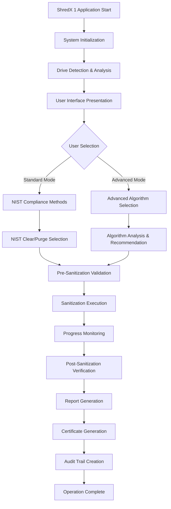
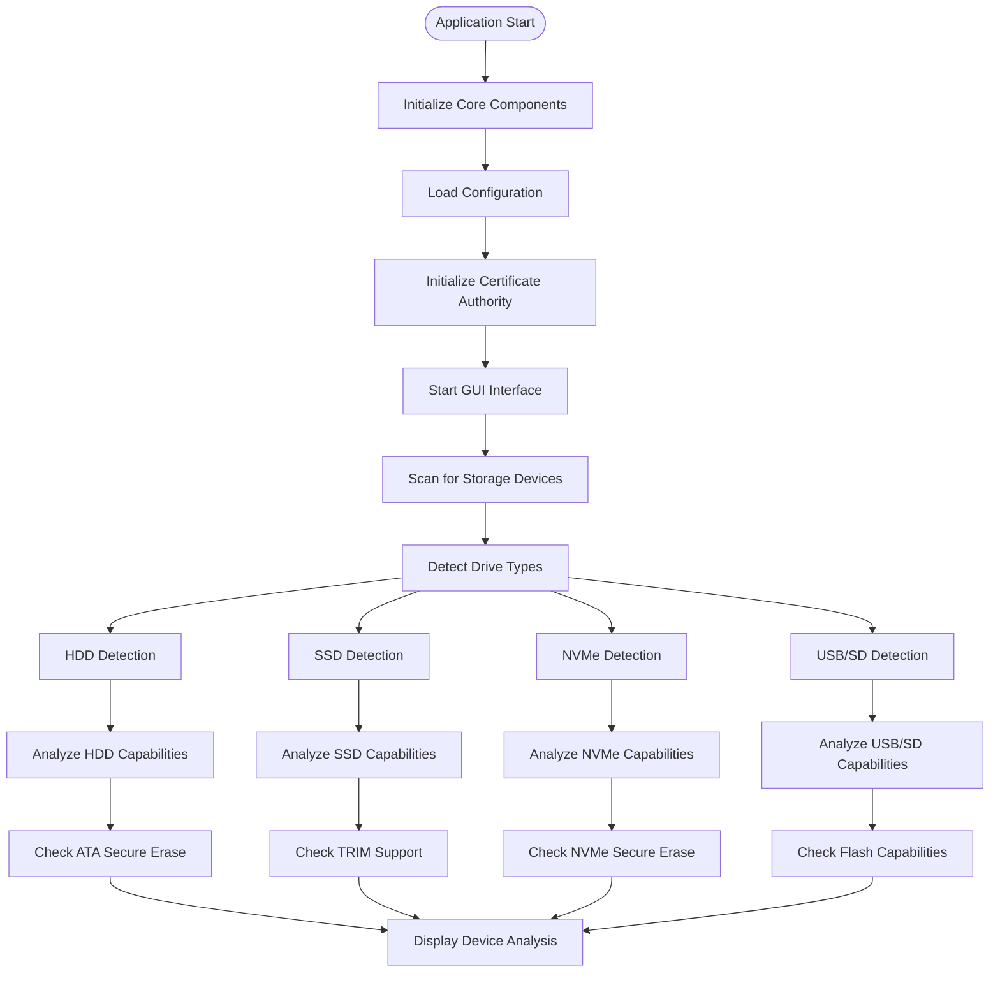
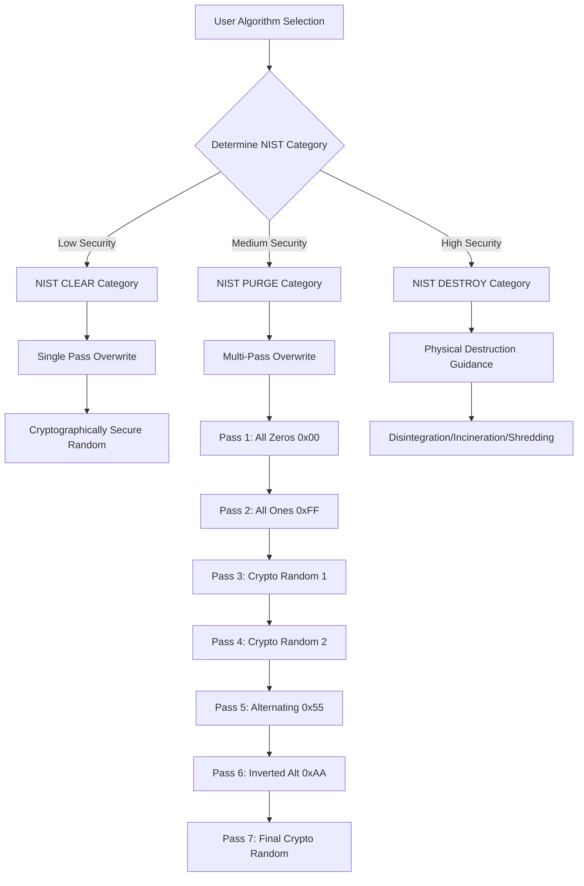
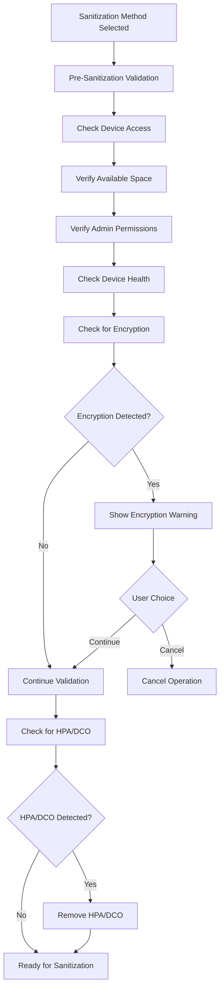
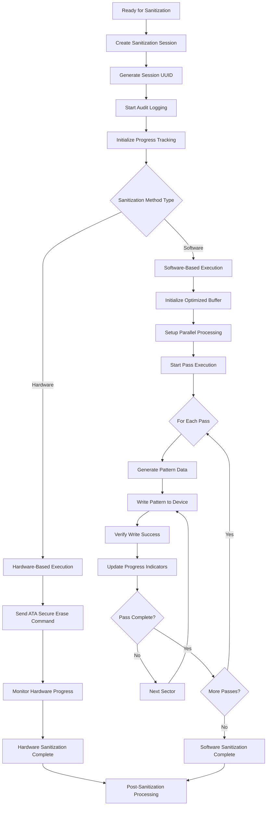
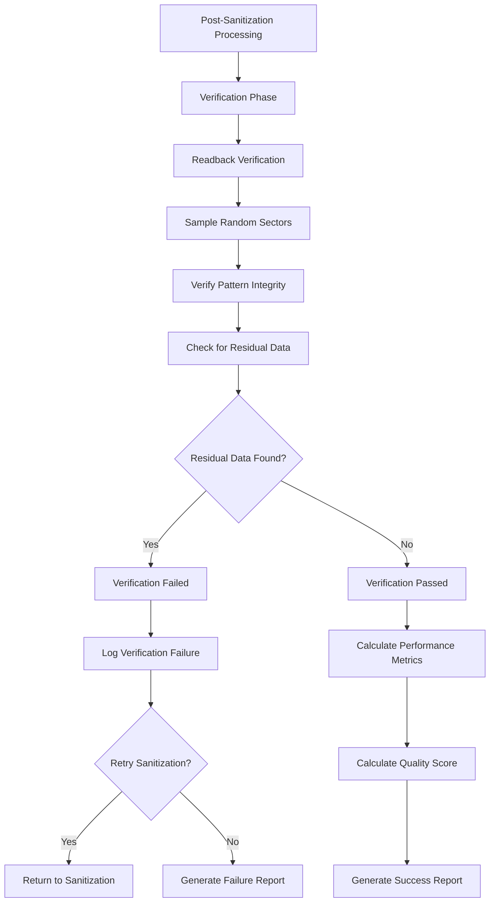
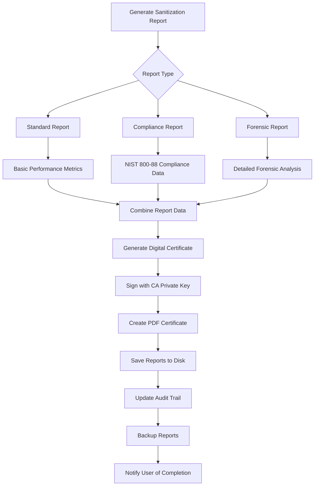
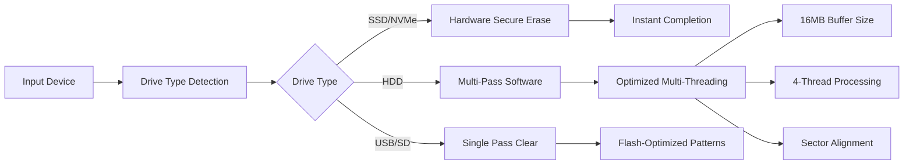

# 🔒 ShredX 1 - NIST SP 800-88 Compliant Data Sanitization Workflow

## 📋 Overview
This document outlines the complete workflow for ShredX 1, a comprehensive data sanitization tool that follows **NIST SP 800-88 Rev. 1 Guidelines for Media Sanitization**.

---

## 🏗️ System Architecture Overview



---

## 🔍 Detailed Workflow Chart

### Phase 1: System Initialization & Discovery



### Phase 2: User Interface & Mode Selection

```mermaid
graph TD
    DisplayResults[Device Analysis Complete] --> ShowGUI[Show Primary Interface]
    ShowGUI --> ModeSelect{User Mode Selection}
    
    ModeSelect -->|Standard Mode| StandardUI[Show Standard Interface]
    ModeSelect -->|Advanced Mode| AdvancedUI[Show Advanced Interface]
    
    StandardUI --> NISTButtons[Show NIST Clear/Purge Options]
    AdvancedUI --> AlgorithmList[Show All Available Algorithms]
    
    NISTButtons --> NISTClear[NIST Clear - Single Pass]
    NISTButtons --> NISTPurge[NIST Purge - 7 Pass]
    
    AlgorithmList --> HardwareMethods[Hardware-Based Methods]
    AlgorithmList --> SoftwareMethods[Software-Based Methods]
    AlgorithmList --> QuickMethods[Quick Methods]
    
    HardwareMethods --> ATASecure[ATA Secure Erase]
    HardwareMethods --> ATAEnhanced[ATA Enhanced Secure Erase]
    HardwareMethods --> NVMeSecure[NVMe Secure Erase]
    HardwareMethods --> NVMeCrypto[NVMe Cryptographic Erase]
    
    SoftwareMethods --> NISTClearAdv[NIST Clear]
    SoftwareMethods --> NISTPurgeAdv[NIST Purge]
    SoftwareMethods --> DoD3Pass[DoD 5220.22-M (3-pass)]
    SoftwareMethods --> DoD7Pass[DoD 5220.22-M ECE (7-pass)]
    SoftwareMethods --> Gutmann[Gutmann Method (35-pass)]
    
    QuickMethods --> RandomPass[Single Random Pass]
    QuickMethods --> ZeroFill[Zero Fill]
    QuickMethods --> OnesFill[Ones Fill]
```

### Phase 3: NIST 800-88 Sanitization Categories



### Phase 4: Pre-Sanitization Validation



### Phase 5: Sanitization Execution Engine



### Phase 6: Verification & Quality Assurance



### Phase 7: Reporting & Certification



---

## 🎯 NIST 800-88 Compliance Matrix

| NIST Category | Security Level | Method | Use Case | Implementation |
|---------------|----------------|---------|----------|----------------|
| **CLEAR** | Confidential | Single Pass Overwrite | Software recovery protection | `sanitization.rs::clear()` |
| **PURGE** | Secret/Top Secret | Multi-Pass Overwrite | Laboratory recovery protection | `sanitization.rs::purge()` |
| **DESTROY** | Highest Security | Physical Destruction | Complete assurance | Physical guidance only |

---

## 🔧 Technical Implementation Flow

### Core Components

1. **Main Application** (`main.rs`)
   - GUI interface using egui
   - Drive detection and analysis
   - User interaction handling

2. **Sanitization Engine** (`sanitization.rs`)
   - NIST 800-88 compliant algorithms
   - Multi-pass overwrite patterns
   - Progress tracking and reporting

3. **Advanced Wiper** (`advanced_wiper.rs`)
   - Hardware-based sanitization
   - ATA/NVMe secure erase commands
   - Algorithm selection and optimization

4. **Core Engine** (`core/engine.rs`)
   - Session management
   - Certificate generation
   - Audit trail creation

5. **Security Module** (`security/`)
   - Certificate authority
   - Digital signatures
   - Report generation

---

## 📊 Performance Optimization Strategy



---

## 🛡️ Security Assurance Levels

### Level 1: NIST CLEAR
- **Target**: Protection against software recovery tools
- **Method**: Single cryptographic random overwrite
- **Speed**: Fast (minutes)
- **Use Case**: General business data

### Level 2: NIST PURGE  
- **Target**: Protection against laboratory analysis
- **Method**: 7-pass cryptographic destruction
- **Speed**: Moderate (hours)
- **Use Case**: Sensitive/classified data

### Level 3: NIST DESTROY
- **Target**: Complete physical assurance
- **Method**: Physical destruction guidance
- **Speed**: N/A
- **Use Case**: Top secret/critical data

---

## 📋 Operational Checklist

### Pre-Operation
- [ ] Administrator privileges verified
- [ ] Target device identified and accessible
- [ ] Device type and capabilities analyzed
- [ ] Encryption status checked
- [ ] HPA/DCO detection completed
- [ ] Backup verification (if applicable)

### During Operation
- [ ] Progress monitoring active
- [ ] Real-time logging enabled
- [ ] Performance metrics tracking
- [ ] Error handling and recovery
- [ ] User cancellation support

### Post-Operation
- [ ] Verification testing completed
- [ ] Quality score calculated
- [ ] Compliance report generated
- [ ] Digital certificate created
- [ ] Audit trail updated
- [ ] Reports archived securely

This workflow ensures complete NIST SP 800-88 compliance while providing maximum efficiency and security assurance for all storage device types.