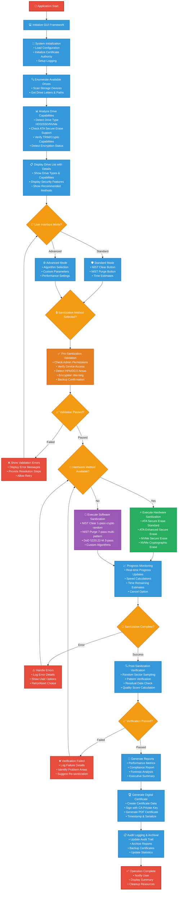

```mermaid
graph TD
    A[🚀 Application Start] --> B[💻 Initialize GUI Framework]
    B --> C[🔧 System Initialization<br/>• Load Configuration<br/>• Initialize Certificate Authority<br/>• Setup Logging]
    C --> D[🔍 Enumerate Available Drives<br/>• Scan Storage Devices<br/>• Get Drive Letters & Paths]
    D --> E[📊 Analyze Drive Capabilities<br/>• Detect Drive Type HDD/SSD/NVMe<br/>• Check ATA Secure Erase Support<br/>• Verify TRIM/Crypto Capabilities<br/>• Detect Encryption Status]
    E --> F[📋 Display Drive List with Details<br/>• Show Drive Types & Capabilities<br/>• Display Security Features<br/>• Show Recommended Methods]
    
    F --> G{👤 User Interface Mode?}
    G -->|Standard| H[🛡️ Standard Mode<br/>• NIST Clear Button<br/>• NIST Purge Button<br/>• Time Estimates]
    G -->|Advanced| I[⚙️ Advanced Mode<br/>• Algorithm Selection<br/>• Custom Parameters<br/>• Performance Settings]
    
    H --> J{🔒 Sanitization Method Selected?}
    I --> J
    J --> K[✅ Pre-Sanitization Validation<br/>• Check Admin Permissions<br/>• Verify Device Access<br/>• Detect HPA/DCO Areas<br/>• Encryption Warning<br/>• Backup Confirmation]
    
    K --> L{✅ Validation Passed?}
    L -->|Failed| M[❌ Show Validation Errors<br/>• Display Error Messages<br/>• Provide Resolution Steps<br/>• Allow Retry]
    M --> G
    
    L -->|Passed| N{🔧 Hardware Method Available?}
    N -->|Yes| O[⚡ Execute Hardware Sanitization<br/>• ATA Secure Erase Standard<br/>• ATA Enhanced Secure Erase<br/>• NVMe Secure Erase<br/>• NVMe Cryptographic Erase]
    N -->|No| P[🔄 Execute Software Sanitization<br/>• NIST Clear 1-pass crypto random<br/>• NIST Purge 7-pass multi-pattern<br/>• DoD 5220.22-M 3-pass<br/>• Custom Algorithms]
    
    O --> Q[📈 Progress Monitoring<br/>• Real-time Progress Updates<br/>• Speed Calculations<br/>• Time Remaining Estimates<br/>• Cancel Option]
    P --> Q
    
    Q --> R{🔄 Sanitization Complete?}
    R -->|Error| S[⚠️ Handle Errors<br/>• Log Error Details<br/>• Show User Options<br/>• Retry/Abort Choice]
    S --> N
    
    R -->|Success| T[🔍 Post-Sanitization Verification<br/>• Random Sector Sampling<br/>• Pattern Verification<br/>• Residual Data Check<br/>• Quality Score Calculation]
    
    T --> U{✅ Verification Passed?}
    U -->|Failed| V[❌ Verification Failed<br/>• Log Failure Details<br/>• Identify Problem Areas<br/>• Suggest Re-sanitization]
    V --> N
    
    U -->|Passed| W[📄 Generate Reports<br/>• Performance Metrics<br/>• Compliance Report<br/>• Forensic Analysis<br/>• Executive Summary]
    W --> X[🏆 Generate Digital Certificate<br/>• Create Certificate Data<br/>• Sign with CA Private Key<br/>• Generate PDF Certificate<br/>• Timestamp & Serialize]
    X --> Y[📋 Audit Logging & Archival<br/>• Update Audit Trail<br/>• Archive Reports<br/>• Backup Certificates<br/>• Update Statistics]
    Y --> Z[✅ Operation Complete<br/>• Notify User<br/>• Display Summary<br/>• Cleanup Resources]
    
    %% Styling
    classDef startEnd fill:#e74c3c,stroke:#c0392b,stroke-width:3px,color:#fff
    classDef process fill:#3498db,stroke:#2980b9,stroke-width:2px,color:#fff
    classDef decision fill:#f39c12,stroke:#e67e22,stroke-width:2px,color:#fff
    classDef validation fill:#e67e22,stroke:#d35400,stroke-width:2px,color:#fff
    classDef hardware fill:#27ae60,stroke:#229954,stroke-width:2px,color:#fff
    classDef software fill:#9b59b6,stroke:#8e44ad,stroke-width:2px,color:#fff
    classDef error fill:#e74c3c,stroke:#c0392b,stroke-width:2px,color:#fff
    classDef success fill:#27ae60,stroke:#229954,stroke-width:2px,color:#fff
    
    class A,Z startEnd
    class B,C,D,E,F,H,I,Q,T,W,X,Y process
    class G,J,L,N,R,U decision
    class K validation
    class O hardware
    class P software
    class M,S,V error
```